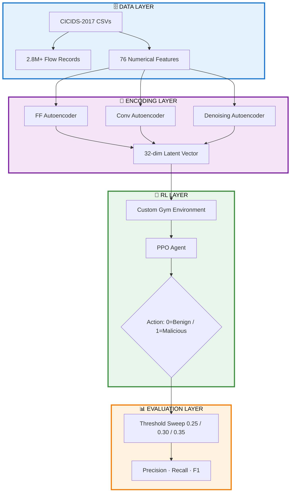

<!---------------------------------------------------------------------------->
<!--  HERO — Full-width waving banner                                        -->
<!---------------------------------------------------------------------------->

<div align="center">


</div>

<!---------------------------------------------------------------------------->
<!--  BADGES                                                                 -->
<!---------------------------------------------------------------------------->

<div align="center">

<br/>

[](https://python.org)&nbsp;
[](https://www.tensorflow.org/)&nbsp;
[](https://stable-baselines3.readthedocs.io/)&nbsp;
[](https://www.unb.ca/cic/datasets/ids-2017.html)&nbsp;
[](https://github.com/kumarpiyushraj/Network-Anomaly-Detection-using-RL-model-and-Autoencoders/blob/main/Network_Anomaly_Detection.ipynb)&nbsp;
[](https://github.com/kumarpiyushraj/Network-Anomaly-Detection-using-RL-model-and-Autoencoders)

<br/><br/>

</div>

<!---------------------------------------------------------------------------->
<!--  STATS STRIP                                                            -->
<!---------------------------------------------------------------------------->


<br/><br/>

<!---------------------------------------------------------------------------->
<!--  AT A GLANCE                                                            -->
<!---------------------------------------------------------------------------->

<div align="center">

### 📊 &nbsp;At a Glance

| 🗄️ Dataset | 🔢 Features | 🧠 Autoencoders | 🤖 RL Algorithm | 🎯 Best F1 | 🏆 Peak Reward |
|:---:|:---:|:---:|:---:|:---:|:---:|
| **CICIDS-2017** | **`76`** | **`3`** | **`PPO`** | **`~0.92`** | **`4,932`** |

</div>

<br/><br/>

<!---------------------------------------------------------------------------->
<!--  TABLE OF CONTENTS                                                      -->
<!---------------------------------------------------------------------------->


<br/>

<div align="center">

| # | Section | # | Section |
|:---:|:---|:---:|:---|
| 01 | [🌟 Overview](#overview) | 07 | [📈 Training Behaviour](#training-behaviour) |
| 02 | [🏆 Key Results](#key-results) | 08 | [📁 Dataset Summary](#dataset-summary) |
| 03 | [🔧 Pipeline Architecture](#pipeline-architecture) | 09 | [🚀 Quick Start](#quick-start) |
| 04 | [🧠 Model Architecture](#model-architecture) | 10 | [📦 Requirements](#requirements) |
| 05 | [🤖 Reinforcement Learning](#reinforcement-learning) | 11 | [🔮 Future Enhancements](#future-enhancements) |
| 06 | [📊 Classification Results](#classification-results) | 12 | [📜 References & Acknowledgements](#references-and-acknowledgements) |

</div>

<br/><br/>

<!---------------------------------------------------------------------------->
<!--  OVERVIEW                                                               -->
<!---------------------------------------------------------------------------->

<a name="overview"></a>


<br/>

This project implements a hybrid **Network Intrusion Detection System (NIDS)** that combines **unsupervised feature learning** through autoencoders with **adaptive decision-making** via the **PPO reinforcement learning algorithm**. The pipeline builds latent representations of network flows, embeds them into a custom RL environment, and trains an agent to detect intrusions through reward-driven optimisation.

<br/>

> **The emergent result:** A PPO agent operating entirely on 32-dimensional latent vectors — not raw features — learns to distinguish malicious traffic from benign with ~92% F1, dramatically outperforming raw reconstruction-threshold baselines.

<br/>

<div align="center">

| &nbsp; | Stage | What It Does |
|:---:|:---|:---|
| 1️⃣ | **Feature Extraction** | Three autoencoder architectures compress 76 raw features → 32-dim latent vectors |
| 2️⃣ | **RL Environment** | Custom Gymnasium environment wraps latent observations with reward-shaped actions |
| 3️⃣ | **PPO Training** | Agent trains over 3,000+ timesteps per iteration with stable policy convergence |
| 4️⃣ | **Evaluation** | Deterministic action evaluation at multiple probability thresholds (0.25 / 0.30 / 0.35) |

</div>

<br/><br/>

<!---------------------------------------------------------------------------->
<!--  KEY RESULTS                                                            -->
<!---------------------------------------------------------------------------->

<a name="key-results"></a>


<br/>

> Evaluated across multiple training runs using deterministic PPO policy with probability threshold sweeping.

<br/>

### 📋 PPO Mean Reward — Across Experiments

<div align="center">

| Run | Mean Reward | Verdict |
|:---:|:---:|:---:|
| Run 1 | **`4,415`** | ✅ Strong |
| Run 2 | **`4,839`** | ✅ Stronger |
| Run 3 | **`4,932`** | 🥇 Best |

</div>

<br/>

### 🎯 Scorecard — Best Threshold (0.30)

<div align="center">

| Metric | Score | Assessment |
|:---|:---:|:---:|
| Precision | **`~0.92`** | ✅ WIN |
| Recall | **`~0.92`** | ✅ WIN |
| F1-Score | **`~0.92`** | ✅ WIN |
| False Positives | **Extremely Low** | ✅ WIN |

</div>

<br/>

> ► Best balance achieved at **threshold = 0.30** — PPO significantly outperforms raw autoencoder reconstruction thresholds. Latent-space feature learning drastically improves RL stability and classification quality.

<br/><br/>

<!---------------------------------------------------------------------------->
<!--  PIPELINE ARCHITECTURE                                                  -->
<!---------------------------------------------------------------------------->

<a name="pipeline-architecture"></a>


<br/>

The full system spans **four layers**: raw CICIDS-2017 flows → autoencoder latent encoding → PPO RL environment → threshold-based evaluation & reporting. Every component connects — from preprocessing through latent compression, into the reward engine, and out to classification metrics.

<br/>

### 🗂️ Three-Stage Pipeline Flow

<div align="center">



</div>

<br/>

### 🏊 Four Layers at a Glance

<div align="center">

| Layer | Components | Role |
|:---|:---|:---|
| 🔵 **Data & Ingest** | CICIDS-2017 CSVs · Min-Max Scaling · Train/Test Split | Loads and normalises 2.8M+ flow records across 76 features |
| 🟣 **Encoding** | FF-AE · Conv-AE · DAE · 32-dim latent | Three architectures compress raw features into dense latent representations |
| 🟢 **RL Decision** | Gymnasium Env · PPO Policy · Reward Engine | Agent acts on latent vectors; shaped rewards drive intrusion detection |
| 🟡 **Evaluation** | Threshold Sweep · Precision/Recall/F1 · Mean Reward | Multi-threshold evaluation; composite metrics confirm generalisation |

</div>

<br/><br/>

<!---------------------------------------------------------------------------->
<!--  MODEL ARCHITECTURE                                                     -->
<!---------------------------------------------------------------------------->

<a name="model-architecture"></a>


<br/>

### 🔗 Autoencoder Architectures

<div align="center">

| Model | Architecture | Latent Dim | Val Loss | Strength |
|:---|:---|:---:|:---:|:---|
| **FF-AE** (Feedforward) | `Dense(128) → Dense(64) → Dense(32)` → decoder | `32` | Stable | Compressed baseline representation |
| **Conv-AE** (Convolutional) | `Conv1D + MaxPool → latent(32)` → decoder | `32` | **~0.67** | Strongest reconstruction performance |
| **DAE** (Denoising) | `Dense + Dropout (multiple layers) → latent(32)` → decoder | `32` | **~0.52** | Best reconstruction accuracy overall |

</div>

<br/>

```
AUTOENCODER — SHARED STRUCTURE
────────────────────────────────────────────
Input  (76 features)
   ↓  Dense / Conv1D encoder layers
   ↓  Latent representation  (32-dim)       ← fed to PPO environment
   ↑  Decoder layers
Output (76 reconstructed features)
────────────────────────────────────────────
```

<br/>

### 🏛️ PPO Policy Network

<div align="center">

| Module | Architecture |
|:---|:---|
| **Input** | `latent_vector (32)` — output of best autoencoder encoder |
| **Hidden Layer 1** | `Linear(32 → 128) + ReLU` |
| **Hidden Layer 2** | `Linear(128 → 128) + ReLU` |
| **Output Heads** | **Policy Head** `→ action logits (2)` &nbsp;+&nbsp; **Value Head** `→ V(s) scalar` |

</div>

<br/>

```
PPO POLICY — MLP
────────────────────────────────────────────
Latent Vector (32)
   ↓ Dense(128) + ReLU
   ↓ Dense(128) + ReLU
   ↓ Policy Head      → P(Benign | Malicious)
   ↓ Value  Head      → V(s)
────────────────────────────────────────────
```

<br/><br/>

<!---------------------------------------------------------------------------->
<!--  REINFORCEMENT LEARNING                                                 -->
<!---------------------------------------------------------------------------->

<a name="reinforcement-learning"></a>


<br/>

### ⏱️ Per Time Step — Decision Flow

<div align="center">

| Step | From → To | Action |
|:---:|:---|:---|
| 1 | Network Flow → Autoencoder | Raw 76-feature vector encoded into 32-dim latent |
| 2 | Autoencoder → Gym Environment | Latent vector served as observation `obs(32)` |
| 3 | Environment → PPO Agent | Agent receives observation; selects action via policy |
| 4 | PPO Agent → Environment | Returns `action ∈ {0=Benign, 1=Malicious}` |
| 5 | Environment → self | Computes shaped reward; updates episode state |
| 6 | Agent → self | Stores transition · updates policy · adjusts value estimate |

</div>

<br/>

### 🎯 Reward Design

<div align="center">

| Event | Reward | Rationale |
|:---|:---:|:---|
| ✅ Correct detection (TP or TN) | **`+2`** | Reinforce accurate classification |
| ❌ Missed attack (FN) | **`−4`** | Heavily penalise missed intrusions — security-critical |
| ⚠️ False alarm (FP) | **`−1`** | Lightly penalise false positives to preserve usability |

</div>

<br/>

> **Design rationale:** The asymmetric penalty (−4 for missed attacks vs −1 for false alarms) encodes the real-world cost structure of NIDS — missing an intrusion is far more damaging than flagging benign traffic.

<br/>

### 🏗️ Custom Gymnasium Environment

<div align="center">

| Parameter | Value | Notes |
|:---|:---:|:---|
| Observation space | **`Box(32,)`** | 32-dim latent vector from autoencoder encoder |
| Action space | **`Discrete(2)`** | `0 = Benign` · `1 = Malicious` |
| Policy network | **`MLP [128, 128]`** | Two hidden layers, trained end-to-end with PPO |
| Timesteps / iteration | **`3,000+`** | Repeated training runs show stable convergence |
| Framework | **`Stable-Baselines3`** | PPO implementation with Gymnasium compatibility |

</div>

<br/><br/>

<!---------------------------------------------------------------------------->
<!--  CLASSIFICATION RESULTS                                                 -->
<!---------------------------------------------------------------------------->

<a name="classification-results"></a>


<br/>

> Evaluated using deterministic PPO actions across three probability thresholds after training convergence.

<br/>

### 📋 All Thresholds — Head-to-Head

<div align="center">

| Threshold | Precision | Recall | F1-Score | Assessment |
|:---:|:---:|:---:|:---:|:---:|
| `0.25` | ~0.91 | ~0.92 | ~0.92 | ✅ Strong |
| `0.30` | ~0.92 | ~0.92 | **~0.92** | 🥇 **Best Balance** |
| `0.35` | ~0.92 | ~0.89 | ~0.90 | ⚠️ Recall drops |

</div>

<br/>

### 🎯 Best Configuration — Threshold 0.30

<div align="center">

| Metric | Value | vs Raw AE Threshold | Verdict |
|:---|:---:|:---:|:---:|
| Precision | **`~0.92`** | Significantly higher | ✅ WIN |
| Recall | **`~0.92`** | Significantly higher | ✅ WIN |
| F1-Score | **`~0.92`** | Significantly higher | ✅ WIN |
| False Positives | **Extremely Low** | Dramatically reduced | ✅ WIN |

</div>

<br/>

> ► All metrics confirm PPO on latent features **outperforms raw reconstruction-threshold baselines** — latent-space learning stabilises the RL training signal and yields a fundamentally smarter detection policy.

<br/><br/>

<!---------------------------------------------------------------------------->
<!--  TRAINING BEHAVIOUR                                                     -->
<!---------------------------------------------------------------------------->

<a name="training-behaviour"></a>


<br/>

### 🧠 Autoencoder Training

<div align="center">

| Model | Final Val Loss | Trend | Notes |
|:---|:---:|:---:|:---|
| **FF-AE** | Stable convergence | 📉 Decreasing | Baseline compressed representation |
| **Conv-AE** | **~0.67** | 📉 Converged | Strongest reconstruction; captures spatial patterns |
| **DAE** | **~0.52** | 📉 Best | Best reconstruction accuracy; robust to noise |

</div>

<br/>

### 🤖 PPO Training Dynamics

<div align="center">

| Metric | Behaviour | Interpretation |
|:---|:---:|:---|
| KL Divergence | Stabilises | Policy updates stay conservative — no collapse |
| Value Loss | Decreases | Value function improves — better credit assignment |
| Entropy | Decreases steadily | Policy becomes more confident over training |
| Explained Variance | Improves | Return predictions get more accurate |
| Training FPS | **~220** | Efficient CPU-side training throughput |

</div>

<br/>

> **Key insight:** The monotonic entropy decrease — from high uncertainty to confident action selection — combined with stable KL divergence confirms PPO's clipped objective successfully prevents destructive policy updates throughout all training runs.

<br/><br/>

<!---------------------------------------------------------------------------->
<!--  DATASET SUMMARY                                                        -->
<!---------------------------------------------------------------------------->

<a name="dataset-summary"></a>


<br/>

### 🏗️ CICIDS-2017 — Dataset Configuration

<div align="center">

| Parameter | Value | Notes |
|:---|:---:|:---|
| Total flow records | **2.8M+** | Multi-day capture across 5 days |
| Numerical features | **76** | Cleaned; non-numerical fields removed |
| Class distribution | **Highly imbalanced** | Majority benign; minority attack flows |
| Scaling | **Min-Max** | All features normalised to [0, 1] |
| Split | **Train / Test** | Stratified split preserving class ratios |

</div>

<br/>

### 🎭 Attack Categories Covered

<div align="center">

| Category | Examples |
|:---|:---|
| 🌊 **Volumetric** | DDoS, DoS (GoldenEye, Hulk, Slowloris, SlowHTTPTest) |
| 🔐 **Credential** | Brute Force (FTP-Patator, SSH-Patator) |
| 🌐 **Web** | SQL Injection, XSS, Web Attacks |
| 🤖 **Persistence** | Botnet (ARES) |
| 🔍 **Reconnaissance** | Port Scan, Infiltration |

</div>

<br/>

### 🔄 Preprocessing Pipeline

<div align="center">

| Step | Action |
|:---:|:---|
| 1 | Remove non-numerical and identifier fields |
| 2 | Handle `inf` / `NaN` values — clip or impute |
| 3 | Apply Min-Max scaling → all features in `[0, 1]` |
| 4 | Stratified train / test split |
| 5 | Encode via chosen autoencoder → 32-dim latent vector |
| 6 | Feed latent vectors into Gymnasium RL environment |

</div>

<br/><br/>

<!---------------------------------------------------------------------------->
<!--  QUICK START                                                            -->
<!---------------------------------------------------------------------------->

<a name="quick-start"></a>


<br/>

### ☁️ Option 1 — Jupyter Notebook *(Recommended)*

<div align="center">

| Step | Action |
|:---:|:---|
| 1 | Clone the repository (see below) |
| 2 | Place CICIDS-2017 CSV files inside `Dataset/` |
| 3 | Install dependencies via `pip install -r requirements.txt` |
| 4 | Launch `jupyter notebook Network_Anomaly_Detection.ipynb` |
| 5 | **Run All** — pipeline trains all three autoencoders then PPO |

</div>

<br/>

### 💻 Option 2 — Clone & Run

```bash
git clone https://github.com/kumarpiyushraj/Network-Anomaly-Detection-using-RL-model-and-Autoencoders
cd Network-Anomaly-Detection-using-RL-model-and-Autoencoders

pip install -r requirements.txt
jupyter notebook Network_Anomaly_Detection.ipynb
```

<br/>

### 🧪 Dataset Placement

```
Network-Anomaly-Detection/
│
├── 📓 Network_Anomaly_Detection.ipynb
├── 📄 requirements.txt
├── 📄 README.md
│
└── 📂 Dataset/                     ← Place CICIDS-2017 CSV files here
    ├── Monday-WorkingHours.pcap_ISCX.csv
    ├── Tuesday-WorkingHours.pcap_ISCX.csv
    ├── Wednesday-WorkingHours.pcap_ISCX.csv
    ├── Thursday-WorkingHours.pcap_ISCX.csv
    └── Friday-WorkingHours.pcap_ISCX.csv
```

<br/><br/>

<!---------------------------------------------------------------------------->
<!--  REQUIREMENTS                                                           -->
<!---------------------------------------------------------------------------->

<a name="requirements"></a>


<br/>

<div align="center">

| Package | Role |
|:---|:---|
| **tensorflow** | Autoencoder training (FF-AE, Conv-AE, DAE) |
| **numpy** | Array operations, data manipulation |
| **pandas** | CSV loading, preprocessing pipelines |
| **scikit-learn** | Min-Max scaling, train/test split, metrics |
| **matplotlib** | Training curves, evaluation plots |
| **gymnasium** | Custom RL environment for anomaly detection |
| **stable-baselines3[extra]** | PPO algorithm implementation |
| **seaborn** | Statistical visualisation overlays |

</div>

<br/>

```bash
pip install tensorflow numpy pandas scikit-learn matplotlib gymnasium stable-baselines3[extra] seaborn
```

<br/>

> **Runtime:** Tested with Python `3.9+`. GPU optional — training runs at ~220 fps on CPU.

<br/><br/>

<!---------------------------------------------------------------------------->
<!--  FUTURE ENHANCEMENTS                                                    -->
<!---------------------------------------------------------------------------->

<a name="future-enhancements"></a>


<br/>

<div align="center">

| Enhancement | Description | Impact |
|:---|:---|:---:|
| 🔬 **Variational Autoencoders (VAE)** | Replace deterministic encoders with probabilistic latent spaces for uncertainty modelling | 🔴 High |
| 🕸️ **Graph Neural Networks** | Model flow correlations as graph edges — captures network topology context | 🔴 High |
| 🤝 **Multi-Agent RL** | Deploy multiple specialised agents per attack category | 🟡 Medium |
| ⚡ **Real-Time Deployment** | Integrate with Suricata / Zeek log engines for streaming traffic analysis | 🔴 High |
| 🌊 **Online Learning** | Continuous model updates on live traffic without full retraining | 🟡 Medium |

</div>

<br/><br/>

<!---------------------------------------------------------------------------->
<!--  REFERENCES AND ACKNOWLEDGEMENTS                                        -->
<!---------------------------------------------------------------------------->

<a name="references-and-acknowledgements"></a>


<br/>

### 📚 Citation

```bibtex
@dataset{cic_ids2017,
  author    = {Sharafaldin, Iman and Lashkari, Arash Habibi and Ghorbani, Ali A},
  title     = {Intrusion Detection Evaluation Dataset (CICIDS2017)},
  year      = {2017},
  url       = {https://www.unb.ca/cic/datasets/ids-2017.html}
}
```

<br/>

### 🙏 Acknowledgements

<div align="center">

| Contributor | Role |
|:---|:---|
| **Canadian Institute for Cybersecurity** | CICIDS-2017 dataset — benchmark for NIDS research |
| **TensorFlow / Keras Team** | Autoencoder training framework |
| **Stable-Baselines3** | PPO algorithm — clean, tested RL implementation |
| **Farama Foundation** | Gymnasium — standard RL environment interface |

</div>

<br/>

<div align="center">

**Need Help or Have Questions?**

<br/>

[](https://github.com/kumarpiyushraj/Network-Anomaly-Detection-using-RL-model-and-Autoencoders/issues)&nbsp;
[](https://github.com/kumarpiyushraj/Network-Anomaly-Detection-using-RL-model-and-Autoencoders/discussions)&nbsp;
[](mailto:kmpiyushraj@gmail.com)

</div>

<br/><br/>

<!---------------------------------------------------------------------------->
<!--  FOOTER                                                                 -->
<!---------------------------------------------------------------------------->

<div align="center">

**Built from scratch &nbsp;·&nbsp; TensorFlow 2.x &nbsp;·&nbsp; Stable-Baselines3 PPO &nbsp;·&nbsp; CICIDS-2017 &nbsp;·&nbsp; 2.8M+ flows**

<br/>

[](https://github.com/kumarpiyushraj/Network-Anomaly-Detection-using-RL-model-and-Autoencoders)

<br/>

*© 2025 Kumar Piyush Raj &nbsp;·&nbsp; [GitHub @kumarpiyushraj](https://github.com/kumarpiyushraj)*


</div>
